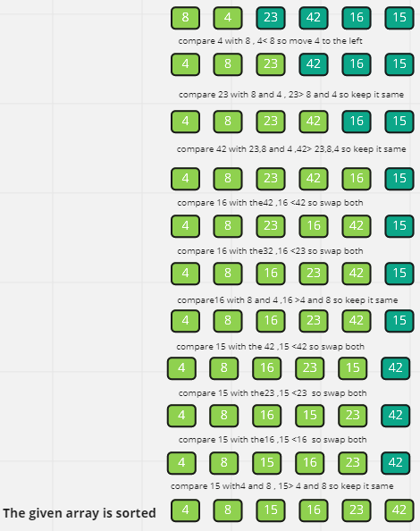

# Insertion sort
Insertion sort is a simple sorting algorithm that works the way we sort playing cards in our hands.

## Definition
Insertion sort in Python is an efficient programming sorting algorithm that is used for making the entire program stable and easy. This sorting algorithm has a lot of features that make it entirely flexible and versatile. The entire concept of Insertion sort relates to bubble sorting somewhat but not completely. It makes the entire implementation of sorting stable, easy, and in place for elements that are present in fewer amounts. Although this sorting paradigm has a lot of advantages with it still it has some of the cons related to the slow processing of elements within the data structure due to nested loops presents within it

## Algorithm

- Iterate over the input elements by growing the sorted array at each iteration.

- Compare the current element with the largest value available in the sorted array.

- If the current element is greater, then it leaves the element in its place and moves on to the next element else it finds its correct position in the sorted array and moves it to that position in the array.

- This is achieved by shifting all the elements towards the right, which are larger than the current element, in the sorted array to one position ahead.

## How Insertion sort works in Python?

Python's Insertion sort algorithm has a working paradigm and flows which are very important to follow. It is considered one of the stable algorithms which manage the order of equal objects from an array at the time of initialization. The concept applies to both the in-place and sorting algorithms as well.

In Insertion sort, if more number elements are present within the array then it has the capability to adjust itself with all the elements and then place them properly. Only one element can be inserted at a time and doesn't require an advance or prior knowledge of anything in this area.

Python's Insertion sort helps in making the process of sorting cards more efficient. All the cards are arranged in ascending order after applying insertion sort. Sorting of cards happens using insertion sort which makes the entire process faster and more data is kept in a single place.

All the nested loops are present in the implementation due to which the sorting of elements is not so fast. Basically, the actual working flow starts in a way where the entire array of elements get split into two sub-arrays such as one unsorted array and one sorted array. The sorted array consists of the first element of the array containing the initial element and the rest of the array contains the unsorted subpart where the elements present in the unsorted set of an array are compared to the sorted array. Once all the arrangement of sorting happens properly then it will be placed properly into a proper sub-array


Inserting elements focus on moving elements towards the left side of the elements in the right side are compared. It means values present on the right side are smaller than the left side eventually. It will repeatedly occur until all the elements are positioned in the correct place like the inplace concept satisfies the need


# Example 

This program demonstrates the Insertion sort in Python with the required output as shown below

```
def InsertionSort(array):
    for i in range ( 1 ,len(array)):
        j =i-1
        temp =array[i]
        while j >=0 and temp <array[j]:
              array[j+1] = array[j]
              j =j-1

        array[j+1] =temp 
    return array
```
***Input Samole array*** 

[8,4,23,42,16,15]

***Output***

[4, 8, 15, 16, 23, 42]


## Pseudocode


```
  InsertionSort(int[] arr)

    FOR i = 1 to arr.length

      int j <-- i - 1
      int temp <-- arr[i]

      WHILE j >= 0 AND temp < arr[j]
        arr[j + 1] <-- arr[j]
        j <-- j - 1

      arr[j + 1] <-- temp
```

### Now let’s see the visual representation of the algorithm





## Let's demonstrates  the example above 
***Sample Array [8,4,23,42,16,15]***
          


-  First Step : Take the first element at index 1 ,from the unsorted array , we store the currrent element in new variable called temp , compare the current element which located in temp with the element at index 0 ,notice  4 < 8 then swap and move 8 to the right and temp (4) at index 0 

`[8,4,23,42,16,15]`  --->  i =1 ,j =0 , temp = 4 

***it will leave us with this unsorted array***   `[4,8,23,42,16,15]`

- Second Step : No we have this unsorted array  [4,8,23,42,16,15]and we begin second iteration 

`[4,8,23,42,16,15]` --->  i =2 , j =1 ,temp =23 

Since the current element which located in temp is greater than the element located at index 1 , keep the temp at its , so temp now the element at index 2 which is 23.

- thd Step : Start third iteration with 

`[4,8,23,42,16,15]` --->  i =3 , j =2 ,temp =42

Now temp (42) is greater than the element whicj locates at index 2 42 >23 , then the temp will keep at its and temp =42 


- 4th Step : Start the fourth iteration with
`[4,8,23,42,16,15]` --->  i =4 , j =3 ,temp =16 

it seems that temp (16) is less than element located at index 3 , then swap and move 42 to the right and locate at index 3 the temp which 16 

`[4,8,23,16,42,15]` --->  i =4 , temp =16

- 5th Step : Our temp now is 16 and still smaller than the element located at index 2 , swap again and move 23 to the right and locate temp to the left of its current index , that leave us with this unsorted array 

`[4,8,16,23,42,15]` --->  i =4 ,temp =16

- 6th Step : Compare temp (16) with 8 which is located at index 1 ,since 16 >8 , keep at its and move to the next iteration .

-7th Step : Now we have this unsorted array with 

`[4,8,16,23,42,15]` --->  i =5 , j=4 , temp =15

Since we compare temp (15) which located at index 5 with the element located at index 4 ,we find that 15 < 42 , so swap and move 42 to the right of its index , ind locate our temp to the left at index 4 , now we have  `[4,8,16,23,15,42]`

 then at same iteration keep comparing with the previouse index we find that 15 is smaller than 23 and 16 , so it will keep swapping till our temp located at index 2    `[4,8,15,16,23,42]`

 - Last Step : i will increment to 6, forcing it to break out of the outer for loop and leaving our array now sorted.

 ***Congrats No We Have Our Sorted Array [4,8,15,16,23,42]***


# Conclusion

Python provides an efficient and stable algorithm that is used for making the implementation easier. It gives the developers flexibility and versatility as per the requirement to get the elements placed in the right order. The arrangement of elements in order is quite significant.


