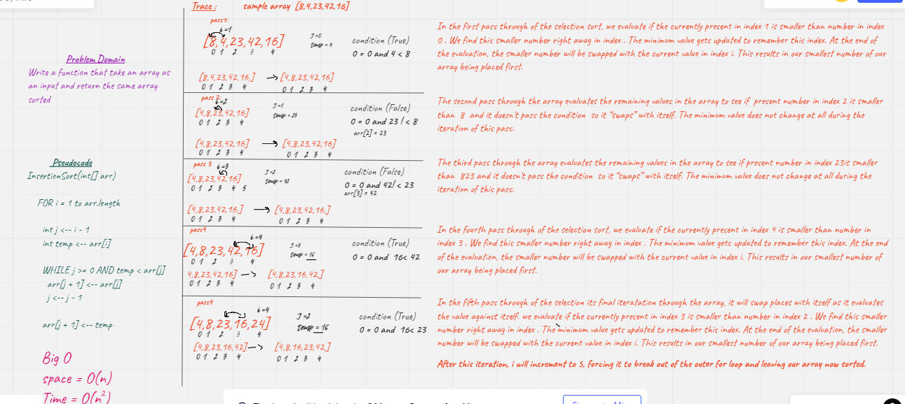

 # Challenge Summary
 Write a function that take an array as input and  return sorted array 
input == > array
output ==>sorted array 

## Whiteboard Process

## Approach & Efficiency

Big (O):

- Space O(n)

- Time O(n2)

## Solution
<!-- Show how to run your code, and examples of it in action -->

code : [Code](./insertion_sort/sort.py)

Test : [Test](./tests/test_insertion_sort.py)

