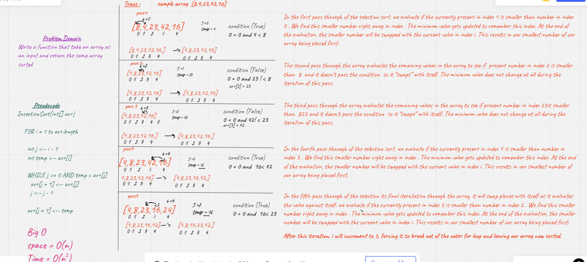

 # Challenge Summary
 Review the pseudocode below, then trace the algorithm by stepping through the process with the provided sample array. Document your explanation by creating a blog article that shows the step-by-step output after each iteration through some sort of visua
 ```
  InsertionSort(int[] arr)

    FOR i = 1 to arr.length

      int j <-- i - 1
      int temp <-- arr[i]

      WHILE j >= 0 AND temp < arr[j]
        arr[j + 1] <-- arr[j]
        j <-- j - 1

      arr[j + 1] <-- temp
 ```

## Whiteboard Process



## Approach & Efficiency

Big (O):

- Space O(n)

- Time O(n2)

## Solution
<!-- Show how to run your code, and examples of it in action -->
Blog : [blog](./BLOG.md)

code : [Code](./insertion_sort/sort.py)

Test : [Test](./tests/test_insertion_sort.py)

