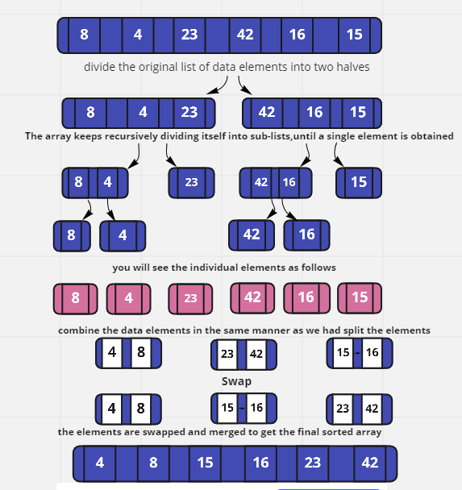

# Merge Sort

The merge sort algorithm is used to sort existing data in an ascending or descending order .

## Defention 
Merge sort is an efficient, general-purpose, and best sorting algorithm with the overall, average, and worst-case time complexity being O(nlogn). The idea is to break down the list into sub-lists until each sub-list has max one element.

It is a general-purpose sorting technique purely based on Divide and Conquer Approach  ,Merge sortis a recursive technique.

## Algorithm 

- Find the middle element required to divide the original array into two parts.

- Divide the original list into two halves in a recursive manner, until every sub-list contains a single element. i.e. call the merge_sort() function for every half recursively.

- Check the data-values, if found in unsorted order, swap the elements and merge the sub-lists to get the original sorted list.


## How Merge Sort works in Python?

 The technique involves analysing an input list and applying a specific function to each half of the main input list. Further, the halves are merged together to get the final result.


 Merge Sortis a recursive technique wherein the unsorted elements are divided into two halves/parts and the function calls itself for the parted halves in a manner such that the halves keep recursively dividing themselves into two parts until the entire array is sorted.

 Merge Sort is a technique where the unsorted elements are divided into two halves/parts and the function calls itself for the parted halves in a manner such that the halves keep recursively dividing themselves into two parts until the entire array is sorted.

 It recursively calls itself for the halves or sub-lists until it gets all the elements separated and that no further division is possible  , Then, the elements are sorted using the basic technique of comparison and swap

 Finally, it merges all the elements together to get the final sorted list of data items.


 ## Example 

 ## Pseudocode

 ```
 ALGORITHM Mergesort(arr)
    DECLARE n <-- arr.length

    if n > 1
      DECLARE mid <-- n/2
      DECLARE left <-- arr[0...mid]
      DECLARE right <-- arr[mid...n]
      // sort the left side
      Mergesort(left)
      // sort the right side
      Mergesort(right)
      // merge the sorted left and right sides together
      Merge(left, right, arr)

ALGORITHM Merge(left, right, arr)
    DECLARE i <-- 0
    DECLARE j <-- 0
    DECLARE k <-- 0

    while i < left.length && j < right.length
        if left[i] <= right[j]
            arr[k] <-- left[i]
            i <-- i + 1
        else
            arr[k] <-- right[j]
            j <-- j + 1

        k <-- k + 1

    if i = left.length
       set remaining entries in arr to remaining values in right
    else
       set remaining entries in arr to remaining values in left
 ```


 ## Now let’s see the visual representation of the algorithm

 

 ## Let's demonstrates the example above

 - First Consider the list of elements: 8,4,23,16,15 , we divide the original list of data elements int two halves
 As the above original array contains 6 elements, we divide the array into a sub-array of 3 elements. The array keeps recursively dividing itself into sub-lists,until a single element is obtained per sub-list i.e. no more further division is possible

 so we find 8 , 4 ,23 and 42 ,16 ,15 

 - Second Step : As clearly stated, the list gets recursively divided into two parts/halves until all the elements are segregated as an individual one.

 - 3rd Step : After the splitting of elements, you will see the individual elements as follows:

 

 - 4th Step : Once the elements are separated, we need to combine the data elements in the same manner as we had split the elements 

 Now, if you have a look at elements 8 and 4, we need to swap their positions and merge them together.

 But Elements 23 and 42  appear in their sorted places, so we merge them as well

 Now, again  if you have a look at elements 16 and 15, we need to swap their positions and merge them together

 - 5th Step :  Taking it ahead, in the second iteration, we compare the sub-array of two elements with the other sub-array and if the elements are found sorted, we merge the sub-arrays altogether

 The sub-array [4,8] is compared with [23,44] . As the data items are not in their sorted order, their positions are swapped.
 they look lie sorted so now compare [23,44] with [15,16] since  the data items are not in their sorted order, their positions are swapped


 6th step : the elements are swapped and merged to get the final sorted array.

## Time complexity of Merge Sort
The time complexity of Merge Sort is: O(nlogn)


 


