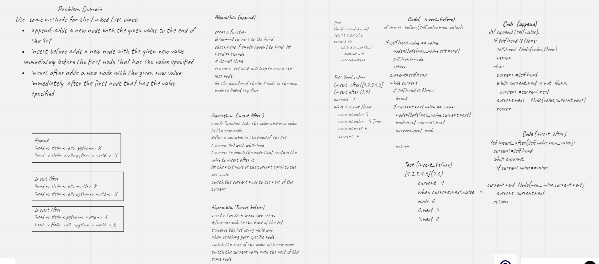

# Challenge Summary
Implement some methods for the Linked List class create linklesd class
and using insert method , insert before and after  a given value of the node and apped to the end of LinkedList

## Whiteboard Process

## Approach & Efficiency
- Create LinkedList class and  Node class
- adds a new node with the given value to the end of the list
- adds a new node with the given new value immediately before the first node that has the value specified
-  adds a new node with the given new value immediately after the first node that has the value specified
