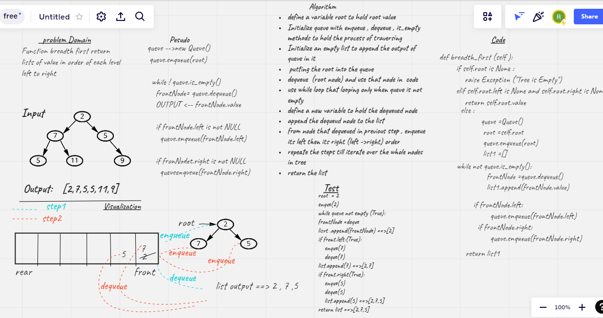

# Challenge Summary
<!-- Description of the challenge -->
Traverse tree using a Breadth-first approach

## Whiteboard Process
<!-- Embedded whiteboard image -->

## Approach & Efficiency
<!-- What approach did you take? Why? What is the Big O space/time for this approach? -->
using list to hold the output node values and return it as an output
Using queue to hold the process of dequeue and enqueue to control the output that will append to the list
using while loop to iterate over when that queue is not empty 

## Solution
<!-- Show how to run your code, and examples of it in action -->
[code](./trees/trees.py)

[tests](./tests/test_trees.py)