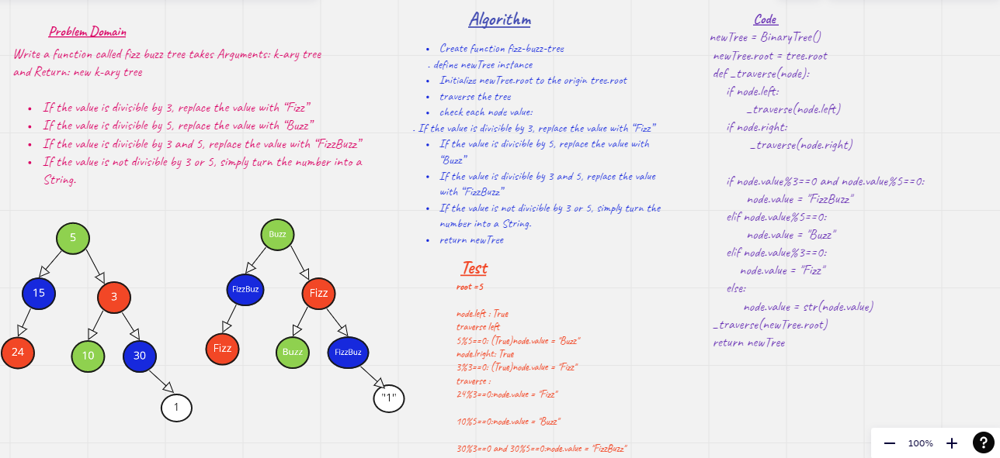

# Challenge Summary
<!-- Description of the challenge -->
Determine whether or not the value of each node is divisible by 3, 5 or both. Create a new tree with the same structure as the original, but the values modified as follows:

If the value is divisible by 3, replace the value with “Fizz”
If the value is divisible by 5, replace the value with “Buzz”
If the value is divisible by 3 and 5, replace the value with “FizzBuzz”
If the value is not divisible by 3 or 5, simply turn the number into a String.

## Whiteboard Process
<!-- Embedded whiteboard image -->

## Approach & Efficiency
<!-- What approach did you take? Why? What is the Big O space/time for this approach? -->
- iterare over the nodes with breadth first order 
using list to hold the output node values and return it as an output
Using queue to hold the process of dequeue and enqueue to control the output that will append to the list
using while loop to iterate over when that queue is not empty 
- using a list to appnd the output regarling the node If the value is divisible by 3 or 5
- return the list 

## Solution
<!-- Show how to run your code, and examples of it in action -->
https://github.com/Raneemoqaily7/data-structures-and-algorathims/pull/16

[code](./trees/trees.py)

[tests](./tests/test_trees.py)