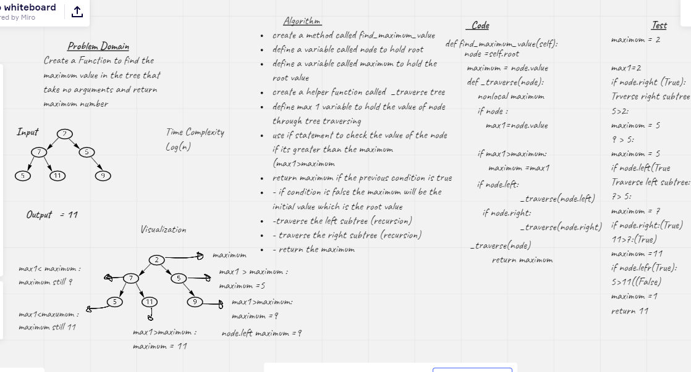

# Challenge Summary
<!-- Description of the challenge -->

Funcation to Find the maximum value stored in the tree
Arguments: None
Returns: number

## Whiteboard Process
<!-- Embedded whiteboard image -->

## Approach & Efficiency
<!-- What approach did you take? Why? What is the Big O space/time for this approach? -->
Define maximum to hold  value of the root and max1 to hold the trr node value in each iteration  create a  traverse recursive to loop  through the tree in each iteration and check if the current value (max1)is bigger than the maximum reassign the greatest value to maximum and return maximum when looping done

Big-O is log(n) for time because the rucrsive internal function

## Solution
<!-- Show how to run your code, and examples of it in action -->
[Code](./trees/trees.py)

[test](./tests/test_trees.py)